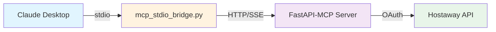

# Claude Desktop Integration Setup

## Overview

This guide helps you connect Claude Desktop to your local Hostaway MCP Server running in Docker.

## Prerequisites

- ✅ Docker container running: `docker compose ps` shows `hostaway-mcp-server` as `healthy`
- ✅ Server accessible at: http://localhost:8000
- ✅ Python 3.12+ and `uv` installed
- ✅ Claude Desktop installed

## Configuration

The Claude Desktop config has been updated at:
```
~/Library/Application Support/Claude/claude_desktop_config.json
```

### Hostaway MCP Server Entry

```json
{
  "mcpServers": {
    "hostaway-mcp": {
      "command": "uv",
      "args": [
        "run",
        "--directory",
        "/Users/darrenmorgan/AI_Projects/hostaway-mcp",
        "python",
        "mcp_stdio_bridge.py"
      ],
      "env": {
        "PYTHONUNBUFFERED": "1"
      }
    }
  }
}
```

## How It Works

1. **Docker Container**: Runs the FastAPI REST API on port 8000
2. **MCP Stdio Server** (`mcp_stdio_server.py`): Native MCP server that calls the HTTP API
3. **Claude Desktop**: Communicates with the MCP server via stdio protocol

```
Claude Desktop (stdio) <-> MCP Stdio Server <-> FastAPI API (HTTP) <-> Hostaway
```

## Setup Steps

### 1. Ensure Docker Container is Running

```bash
cd /Users/darrenmorgan/AI_Projects/hostaway-mcp
docker compose up -d

# Verify it's healthy
docker compose ps
# Should show: hostaway-mcp-server   Up XX seconds (healthy)

# Test the MCP endpoint
curl -s http://localhost:8000/mcp -H "Accept: text/event-stream" --max-time 2 | head -n 3
# Should show: event: endpoint
```

### 2. Test the MCP Server (Optional)

```bash
# Verify the MCP server responds
cd /Users/darrenmorgan/AI_Projects/hostaway-mcp
echo '{"jsonrpc": "2.0", "id": 1, "method": "initialize"}' | uv run python mcp_stdio_server.py

# Should show JSON-RPC response (server is working)
```

### 3. Restart Claude Desktop

1. **Quit Claude Desktop completely** (Cmd+Q)
2. **Reopen Claude Desktop**
3. **Check MCP Servers**: Look for "hostaway-mcp" in the MCP servers list

### 4. Verify Connection

In Claude Desktop, you should see:

- ✅ **hostaway-mcp** server listed as connected
- ✅ **7 tools available**:
  - `list_properties` - List all properties with pagination
  - `get_property_details` - Get detailed property information
  - `check_availability` - Check property availability for date range
  - `search_bookings` - Search bookings with filters
  - `get_booking_details` - Get booking details
  - `get_guest_info` - Get guest information for a booking
  - `get_financial_reports` - Financial reports with revenue/expense breakdown

### 5. Test in Claude Desktop

Try asking Claude:
```
"Use the hostaway-mcp tools to list my first 3 properties"
```

Claude should invoke the `list_properties` tool with `{"limit": 3}`

## Troubleshooting

### Issue: Server Not Connecting

**Check Docker Status:**
```bash
docker compose ps
docker compose logs -f hostaway-mcp
```

**Verify MCP Endpoint:**
```bash
curl http://localhost:8000/mcp
```

### Issue: Bridge Script Error

**Check Python/uv:**
```bash
uv run python --version
# Should be Python 3.12+
```

**Check Dependencies:**
```bash
cd /Users/darrenmorgan/AI_Projects/hostaway-mcp
uv run python -c "import httpx; print('httpx OK')"
```

### Issue: Tools Not Appearing

1. **Check Claude Desktop Logs**:
   - macOS: `~/Library/Logs/Claude/`
   - Look for connection errors

2. **Restart Everything**:
   ```bash
   # Restart Docker
   docker compose restart

   # Quit and reopen Claude Desktop (Cmd+Q)
   ```

### Issue: Authentication Errors

The Hostaway credentials are configured in Docker via `.env` file:
```bash
# Verify credentials are set
cat .env | grep HOSTAWAY
```

Should show:
```
HOSTAWAY_ACCOUNT_ID=your_account_id
HOSTAWAY_SECRET_KEY=your_secret_key
```

## Using the Tools

### Example: Get Listings

In Claude Desktop:
```
"Show me my first 5 properties from Hostaway"
```

### Example: Check Availability

```
"Check availability for listing 400569 in March 2025"
```

### Example: Search Bookings

```
"Find all confirmed bookings for the next 30 days"
```

### Example: Financial Report

```
"Show me financial reports for Q1 2024"
```

## Architecture



## Key Files

- **MCP Server**: `/Users/darrenmorgan/AI_Projects/hostaway-mcp/mcp_stdio_server.py`
- **Config File**: `~/Library/Application Support/Claude/claude_desktop_config.json`
- **Docker Compose**: `/Users/darrenmorgan/AI_Projects/hostaway-mcp/docker-compose.yml`
- **API Server**: `/Users/darrenmorgan/AI_Projects/hostaway-mcp/src/api/main.py`

## Stopping the Server

When done testing:

```bash
# Stop Docker container
cd /Users/darrenmorgan/AI_Projects/hostaway-mcp
docker compose down

# Remove from Claude Desktop config if needed
# Edit: ~/Library/Application Support/Claude/claude_desktop_config.json
```

## Next Steps

1. ✅ Test all 9 MCP tools in Claude Desktop
2. ✅ Verify OAuth token refresh works automatically
3. ✅ Test rate limiting (15 req/10s per IP)
4. ✅ Check structured logging in container logs
5. 🚀 Deploy to staging/production when ready

---

**Status**: ✅ Configuration complete - Restart Claude Desktop to connect!
