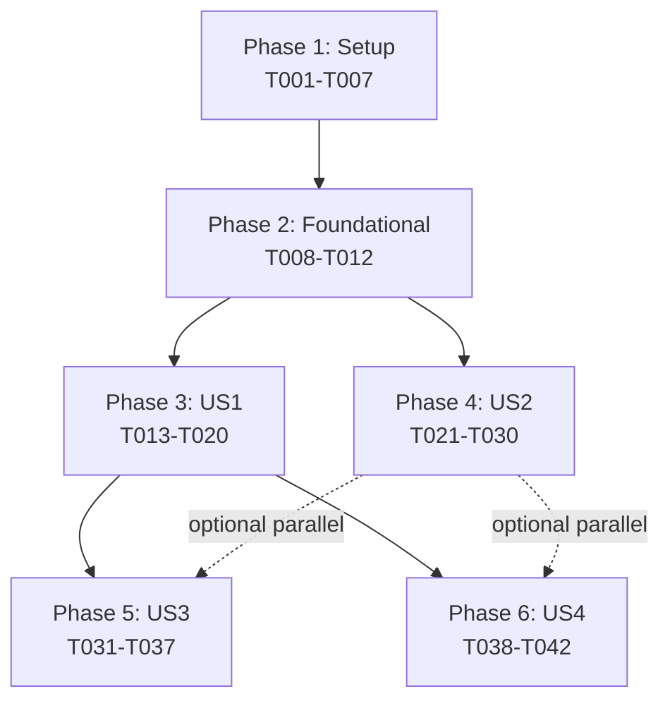

# Implementation Tasks: Production-Ready Dashboard with Design System

**Feature Branch**: `004-we-need-to`
**Created**: 2025-10-14
**Spec**: [spec.md](spec.md) | **Plan**: [plan.md](plan.md)

## Overview

This feature implements a production-ready dashboard UI with shadcn/ui + Tailwind CSS, fixes the broken usage page, and creates a reusable component library. Tasks are organized by user story to enable independent implementation and testing.

**Total Tasks**: 42
**Estimated Duration**: 2-3 days for P1 stories, 1-2 days for P2 stories

---

## Task Organization

Tasks are grouped into phases:
- **Phase 1**: Setup (shared infrastructure - 7 tasks)
- **Phase 2**: Foundational (blocking prerequisites - 5 tasks)
- **Phase 3**: User Story 1 - Dashboard Visual Polish (P1 - 8 tasks)
- **Phase 4**: User Story 2 - Usage Page Functionality Restoration (P1 - 10 tasks)
- **Phase 5**: User Story 3 - Reusable Component Library (P2 - 7 tasks)
- **Phase 6**: User Story 4 - Dashboard Navigation and Structure (P2 - 5 tasks)

**Notation**:
- `[P]` = Parallelizable (can run concurrently with other `[P]` tasks in same phase)
- `[US1]`, `[US2]`, `[US3]`, `[US4]` = User Story tags
- `✓` = Checkpoint marker (verify story completion)

---

## Phase 1: Setup & Configuration (Shared Infrastructure)

**Goal**: Install and configure design system dependencies needed by all user stories.

### T001: [P] Install shadcn/ui CLI and Initialize Configuration
**Story**: Setup
**File**: `dashboard/components.json` (new), `dashboard/tailwind.config.ts`, `dashboard/app/globals.css`
**Description**:
1. Navigate to `dashboard/` directory
2. Run `npx shadcn@latest init`
3. Answer prompts:
   - TypeScript: Yes
   - Style: Default
   - Base color: Slate
   - Global CSS: app/globals.css
   - CSS variables: Yes
   - Tailwind prefix: No
   - Tailwind config: tailwind.config.ts
   - Components alias: @/components
   - Utils alias: @/lib/utils
   - React Server Components: Yes
   - Write config: Yes
4. Verify `components.json` created
5. Verify `tailwind.config.ts` updated with shadcn/ui tokens
6. Verify `app/globals.css` has CSS variables (`:root` block)
7. Verify `lib/utils.ts` created with `cn()` helper

**Dependencies**: None
**Estimated Time**: 10 minutes

---

### T002: [P] Install shadcn/ui Core Components
**Story**: Setup
**Files**: `dashboard/components/ui/*.tsx` (new - 10 components)
**Description**:
Install base UI components needed across all user stories:
1. `npx shadcn@latest add button`
2. `npx shadcn@latest add card`
3. `npx shadcn@latest add input`
4. `npx shadcn@latest add table`
5. `npx shadcn@latest add dialog`
6. `npx shadcn@latest add skeleton`
7. `npx shadcn@latest add alert`
8. `npx shadcn@latest add badge`
9. `npx shadcn@latest add select`
10. `npx shadcn@latest add tooltip`

Verify all components exist in `components/ui/` directory.

**Dependencies**: T001
**Estimated Time**: 5 minutes

---

### T003: [P] Install Chart Library (Recharts)
**Story**: Setup
**File**: `dashboard/package.json`
**Description**:
1. Navigate to `dashboard/` directory
2. Run `npm install recharts`
3. Run `npm install --save-dev @types/recharts`
4. Verify packages added to `package.json`

**Dependencies**: None
**Estimated Time**: 2 minutes

---

### T004: [P] Create Component Folder Structure
**Story**: Setup
**Directories**: `dashboard/components/{usage,billing,api-keys,settings}/` (new)
**Description**:
Create feature-based component folders:
1. `mkdir -p components/usage`
2. `mkdir -p components/billing`
3. `mkdir -p components/api-keys`
4. `mkdir -p components/settings`

**Dependencies**: None
**Estimated Time**: 1 minute

---

### T005: [P] Verify TypeScript Path Aliases
**Story**: Setup
**File**: `dashboard/tsconfig.json`
**Description**:
1. Open `dashboard/tsconfig.json`
2. Verify `compilerOptions.paths` contains: `"@/*": ["./*"]`
3. If missing, add path alias configuration
4. Restart TypeScript server in editor (VS Code: Cmd+Shift+P → Restart TS Server)

**Dependencies**: None
**Estimated Time**: 2 minutes

---

### T006: [P] Install Development Tools (Prettier + ESLint)
**Story**: Setup
**Files**: `dashboard/.prettierrc` (new), `dashboard/.eslintrc.json`
**Description**:
1. Install Prettier: `npm install --save-dev prettier prettier-plugin-tailwindcss`
2. Create `.prettierrc`:
   ```json
   {
     "plugins": ["prettier-plugin-tailwindcss"],
     "semi": false,
     "singleQuote": true,
     "tabWidth": 2,
     "trailingComma": "es5"
   }
   ```
3. Install ESLint plugin: `npm install --save-dev eslint-plugin-tailwindcss`
4. Update `.eslintrc.json`:
   ```json
   {
     "extends": ["next/core-web-vitals", "plugin:tailwindcss/recommended"],
     "plugins": ["tailwindcss"]
   }
   ```

**Dependencies**: None
**Estimated Time**: 5 minutes

---

### T007: Create Design System Test Page
**Story**: Setup
**File**: `dashboard/app/test-design-system/page.tsx` (new)
**Description**:
Create a test page to verify shadcn/ui installation:
```tsx
import { Button } from "@/components/ui/button"
import { Card, CardHeader, CardTitle, CardContent } from "@/components/ui/card"

export default function TestPage() {
  return (
    <div className="container mx-auto p-8">
      <Card>
        <CardHeader>
          <CardTitle>Design System Test</CardTitle>
        </CardHeader>
        <CardContent>
          <div className="space-y-4">
            <Button variant="default">Default Button</Button>
            <Button>Primary Button</Button>
            <Button variant="secondary">Secondary Button</Button>
            <Button variant="destructive">Destructive Button</Button>
            <Button variant="ghost">Ghost Button</Button>
            <Button variant="link">Link Button</Button>
          </div>
        </CardContent>
      </Card>
    </div>
  )
}
```

Test:
1. Run `npm run dev`
2. Navigate to http://localhost:3000/test-design-system
3. Verify card renders with border and rounded corners
4. Verify all 6 buttons render with correct variants
5. Verify buttons show hover states

**Dependencies**: T001, T002
**Estimated Time**: 10 minutes

---

## Phase 2: Foundational Tasks (Blocking Prerequisites)

**Goal**: Complete foundational work that must be done before ANY user story can be implemented.

### T008: Diagnose Usage Page Root Cause
**Story**: Foundational
**File**: `dashboard/app/(dashboard)/usage/page.tsx`
**Description**:
1. Start dev server: `npm run dev`
2. Navigate to http://localhost:3000/usage
3. Open browser DevTools (Console + Network tabs)
4. Document errors found:
   - Console errors (React errors, missing components, data fetching failures)
   - Network failures (Supabase queries, API calls)
   - Component rendering issues
5. Create diagnosis report in task notes
6. Identify specific issues:
   - Missing/broken components? (MetricsSummary, UsageChart)
   - Supabase query errors?
   - Missing chart library?
   - No loading/error/empty states?

**Dependencies**: T001
**Estimated Time**: 15 minutes

---

### T009: Generate Supabase TypeScript Types
**Story**: Foundational
**File**: `dashboard/lib/types/database.ts`
**Description**:
1. Navigate to dashboard directory
2. Run `npx supabase gen types typescript --project-id <project-id> > lib/types/database.ts`
3. Verify types generated for tables:
   - organizations
   - organization_members
   - hostaway_credentials
   - api_keys
   - subscriptions
   - usage_metrics
   - audit_logs
4. Create type exports for usage page:
   ```typescript
   export type UsageMetrics = Database['public']['Tables']['usage_metrics']['Row']
   export type Subscription = Database['public']['Tables']['subscriptions']['Row']
   ```

**Dependencies**: None
**Estimated Time**: 5 minutes

---

### T010: [P] Create Utility Functions for Data Fetching
**Story**: Foundational
**File**: `dashboard/lib/utils/date-helpers.ts` (new)
**Description**:
Create date utility functions used across multiple user stories:
```typescript
export function getCurrentMonthStart(): string {
  const now = new Date()
  return new Date(now.getFullYear(), now.getMonth(), 1).toISOString()
}

export function get30DaysAgo(): string {
  const now = new Date()
  return new Date(now.getTime() - 30 * 24 * 60 * 60 * 1000).toISOString()
}

export function getCurrentBillingPeriod(): { start: Date; end: Date } {
  const now = new Date()
  const start = new Date(now.getFullYear(), now.getMonth(), 1)
  const end = new Date(now.getFullYear(), now.getMonth() + 1, 0)
  return { start, end }
}

export function formatDate(date: Date | string): string {
  return new Date(date).toLocaleDateString('en-US', {
    month: 'short',
    day: 'numeric',
    year: 'numeric',
  })
}

export function formatCurrency(amount: number): string {
  return new Intl.NumberFormat('en-US', {
    style: 'currency',
    currency: 'USD',
  }).format(amount)
}
```

**Dependencies**: None
**Estimated Time**: 10 minutes

---

### T011: [P] Create Billing Calculation Utilities
**Story**: Foundational
**File**: `dashboard/lib/utils/billing-helpers.ts` (new)
**Description**:
Create billing calculation functions used by usage page:
```typescript
import type { UsageMetrics, Subscription } from '@/lib/types/database'

export function calculateProjectedBill(
  metrics: UsageMetrics | null,
  subscription: Subscription | null
): number {
  if (!metrics || !subscription) return 0

  const basePrice = subscription.base_price // e.g., $10
  const perListingPrice = subscription.per_listing_price // e.g., $5
  const listingCount = metrics.listing_count

  return basePrice + (listingCount * perListingPrice)
}

export function formatListingCount(count: number): string {
  return count === 1 ? '1 listing' : `${count} listings`
}

export function formatApiRequestCount(count: number): string {
  if (count >= 1000000) return `${(count / 1000000).toFixed(1)}M`
  if (count >= 1000) return `${(count / 1000).toFixed(1)}K`
  return count.toString()
}
```

**Dependencies**: T009
**Estimated Time**: 10 minutes

---

### T012: Configure Error Boundaries
**Story**: Foundational
**File**: `dashboard/app/(dashboard)/error.tsx`
**Description**:
Verify error boundary exists and handles errors gracefully:
1. Check if `app/(dashboard)/error.tsx` exists
2. If missing, create error boundary:
   ```tsx
   'use client'

   import { useEffect } from 'react'
   import { Button } from '@/components/ui/button'
   import { Alert, AlertTitle, AlertDescription } from '@/components/ui/alert'

   export default function Error({
     error,
     reset,
   }: {
     error: Error & { digest?: string }
     reset: () => void
   }) {
     useEffect(() => {
       console.error(error)
     }, [error])

     return (
       <div className="container mx-auto p-8">
         <Alert variant="destructive">
           <AlertTitle>Something went wrong</AlertTitle>
           <AlertDescription>{error.message}</AlertDescription>
         </Alert>
         <Button onClick={reset} className="mt-4">
           Try again
         </Button>
       </div>
     )
   }
   ```

**Dependencies**: T002
**Estimated Time**: 10 minutes

---

## Phase 3: User Story 1 - Dashboard Visual Polish (P1)

**Goal**: Property managers access a modern, professional dashboard interface with consistent styling, clear visual hierarchy, and polished UI components.

**Independent Test**: Navigate to dashboard homepage - all pages load without visual errors, components render consistently with proper spacing and typography.

---

### T013: [US1] Update Dashboard Layout with Navigation
**Story**: User Story 1 (P1)
**File**: `dashboard/app/(dashboard)/layout.tsx`
**Description**:
Update dashboard layout to use shadcn/ui components:
1. Import Card, Button components
2. Create consistent header:
   - Logo/app name
   - User info (avatar, name)
   - Logout button
3. Create sidebar navigation:
   - Home link
   - Usage link
   - Billing link
   - API Keys link
   - Settings link
   - Highlight active page
4. Add responsive design (mobile: collapsible sidebar)
5. Apply design tokens (spacing, colors, typography)

Example structure:
```tsx
import { Card } from '@/components/ui/card'

export default function DashboardLayout({
  children,
}: {
  children: React.ReactNode
}) {
  return (
    <div className="flex h-screen">
      {/* Sidebar */}
      <aside className="w-64 border-r bg-card">
        {/* Navigation items */}
      </aside>

      {/* Main content */}
      <main className="flex-1 overflow-auto p-8">
        {children}
      </main>
    </div>
  )
}
```

**Dependencies**: T002
**Estimated Time**: 45 minutes

---

### T014: [US1] [P] Apply Design Tokens to Home Page
**Story**: User Story 1 (P1)
**File**: `dashboard/app/(dashboard)/page.tsx`
**Description**:
Update home/overview page with shadcn/ui components:
1. Replace existing markup with Card components
2. Use consistent spacing (space-y-4, p-6)
3. Use typography classes (text-2xl, font-semibold)
4. Add welcome message with user name
5. Add quick stats cards (API requests, listing count)
6. Use design tokens for all styling

**Dependencies**: T002, T013
**Estimated Time**: 30 minutes

---

### T015: [US1] [P] Apply Design Tokens to Billing Page
**Story**: User Story 1 (P1)
**File**: `dashboard/app/(dashboard)/billing/page.tsx`
**Description**:
Update billing page with shadcn/ui components:
1. Replace existing markup with Card components
2. Use Table component for invoice history
3. Use Badge component for status indicators (paid, pending, failed)
4. Add proper spacing and typography
5. Ensure responsive design

**Dependencies**: T002, T013
**Estimated Time**: 30 minutes

---

### T016: [US1] [P] Apply Design Tokens to API Keys Page
**Story**: User Story 1 (P1)
**File**: `dashboard/app/(dashboard)/api-keys/page.tsx`
**Description**:
Update API keys page with shadcn/ui components:
1. Replace existing markup with Card components
2. Use Table component for API key list
3. Use Button component for actions (create, revoke, rotate)
4. Use Badge component for key status
5. Add proper spacing and typography

**Dependencies**: T002, T013
**Estimated Time**: 30 minutes

---

### T017: [US1] [P] Apply Design Tokens to Settings Page
**Story**: User Story 1 (P1)
**File**: `dashboard/app/(dashboard)/settings/page.tsx`
**Description**:
Update settings page with shadcn/ui components:
1. Replace existing markup with Card components
2. Use Input component for form fields
3. Use Button component for save/cancel actions
4. Add proper spacing and typography
5. Add form validation styles

**Dependencies**: T002, T013
**Estimated Time**: 30 minutes

---

### T018: [US1] Add Hover States and Transitions
**Story**: User Story 1 (P1)
**File**: `dashboard/app/(dashboard)/layout.tsx`
**Description**:
Add interactive states to all clickable elements:
1. Navigation links:
   - Hover: background change
   - Active: highlighted state
2. Buttons:
   - Hover: background darken
   - Active: pressed effect
3. Cards:
   - Hover: shadow increase (if interactive)
4. Add transitions (transition-colors, duration-200)

**Dependencies**: T013, T014, T015, T016, T017
**Estimated Time**: 20 minutes

---

### T019: [US1] Test Responsive Design (320px - 2560px)
**Story**: User Story 1 (P1)
**Files**: All dashboard pages
**Description**:
Test dashboard on different screen sizes:
1. Mobile (320px):
   - Sidebar collapses to hamburger menu
   - Content stacks vertically
   - Touch-friendly targets (min 44x44px)
2. Tablet (768px):
   - Sidebar remains visible
   - Cards adjust to 2-column layout
3. Desktop (1024px+):
   - Full layout with sidebar
   - Cards in multi-column grid
4. Large desktop (2560px):
   - Content container max-width (1400px)
   - Centered content

**Dependencies**: T013, T014, T015, T016, T017, T018
**Estimated Time**: 30 minutes

---

### T020: [US1] ✓ Verify Visual Consistency Across All Pages
**Story**: User Story 1 (P1) - CHECKPOINT
**Files**: All dashboard pages
**Description**:
Final verification of User Story 1 acceptance criteria:
1. Navigate between all pages (Home, Usage, Billing, API Keys, Settings)
2. Verify:
   - ✅ No visual errors or broken layouts
   - ✅ Consistent styling (spacing, typography, colors)
   - ✅ Hover states work on all interactive elements
   - ✅ Responsive design works (320px - 2560px)
   - ✅ Navigation clearly indicates active page
3. Run Lighthouse audit: `npx lighthouse http://localhost:3000/`
4. Verify Lighthouse score > 90 for accessibility
5. Document any issues found
6. Fix issues before proceeding

**Dependencies**: T013, T014, T015, T016, T017, T018, T019
**Estimated Time**: 30 minutes

---

## Phase 4: User Story 2 - Usage Page Functionality Restoration (P1)

**Goal**: Property managers view accurate API usage metrics, listing counts, and billing projections on a fully functional usage page.

**Independent Test**: Navigate to /usage page - metrics load without errors, charts display historical data, projected bill calculates correctly.

---

### T021: [US2] Create Usage Page Data Fetching Function
**Story**: User Story 2 (P1)
**File**: `dashboard/lib/data/usage.ts` (new)
**Description**:
Create server-side data fetching function:
```typescript
import { createClient } from '@/lib/supabase/server'
import type { UsageMetrics, Subscription } from '@/lib/types/database'
import { getCurrentMonthStart, get30DaysAgo } from '@/lib/utils/date-helpers'
import { calculateProjectedBill } from '@/lib/utils/billing-helpers'

export interface UsagePageData {
  currentMonthMetrics: {
    totalApiRequests: number
    listingCount: number
    projectedBill: number
    billingPeriod: { start: Date; end: Date }
  } | null
  historicalData: Array<{
    date: string
    totalApiRequests: number
  }>
  error: string | null
}

export async function fetchUsageData(
  organizationId: string
): Promise<UsagePageData> {
  const supabase = createClient()

  try {
    // Fetch current month metrics
    const { data: metricsData, error: metricsError } = await supabase
      .from('usage_metrics')
      .select('*')
      .eq('organization_id', organizationId)
      .gte('month_year', getCurrentMonthStart())
      .single()

    if (metricsError && metricsError.code !== 'PGRST116') {
      throw metricsError
    }

    // Fetch subscription for billing calculation
    const { data: subscriptionData, error: subscriptionError } = await supabase
      .from('subscriptions')
      .select('*')
      .eq('organization_id', organizationId)
      .eq('status', 'active')
      .single()

    if (subscriptionError && subscriptionError.code !== 'PGRST116') {
      throw subscriptionError
    }

    // Fetch 30-day historical data
    const { data: historicalData, error: historicalError } = await supabase
      .from('usage_metrics')
      .select('month_year, total_api_requests')
      .eq('organization_id', organizationId)
      .gte('month_year', get30DaysAgo())
      .order('month_year', { ascending: true })

    if (historicalError) throw historicalError

    return {
      currentMonthMetrics: metricsData
        ? {
            totalApiRequests: metricsData.total_api_requests ?? 0,
            listingCount: metricsData.listing_count ?? 0,
            projectedBill: calculateProjectedBill(metricsData, subscriptionData),
            billingPeriod: getCurrentBillingPeriod(),
          }
        : null,
      historicalData: (historicalData ?? []).map((d) => ({
        date: d.month_year,
        totalApiRequests: d.total_api_requests ?? 0,
      })),
      error: null,
    }
  } catch (error) {
    console.error('Error fetching usage data:', error)
    return {
      currentMonthMetrics: null,
      historicalData: [],
      error: error instanceof Error ? error.message : 'Unknown error',
    }
  }
}
```

**Dependencies**: T009, T010, T011
**Estimated Time**: 30 minutes

---

### T022: [US2] Create MetricsSummary Component
**Story**: User Story 2 (P1)
**File**: `dashboard/components/usage/metrics-summary.tsx` (new)
**Description**:
Create component to display current month metrics:
```tsx
import { Card, CardHeader, CardTitle, CardContent } from '@/components/ui/card'
import { Skeleton } from '@/components/ui/skeleton'
import { formatCurrency, formatDate, formatApiRequestCount, formatListingCount } from '@/lib/utils/helpers'

interface MetricsSummaryProps {
  apiRequests: number
  listingCount: number
  projectedBill: number
  billingPeriod: { start: Date; end: Date }
  loading?: boolean
}

export function MetricsSummary({
  apiRequests,
  listingCount,
  projectedBill,
  billingPeriod,
  loading = false,
}: MetricsSummaryProps) {
  if (loading) {
    return (
      <div className="grid grid-cols-1 md:grid-cols-3 gap-6">
        {[1, 2, 3].map((i) => (
          <Card key={i}>
            <CardHeader>
              <Skeleton className="h-4 w-24" />
            </CardHeader>
            <CardContent>
              <Skeleton className="h-8 w-16" />
            </CardContent>
          </Card>
        ))}
      </div>
    )
  }

  return (
    <div className="grid grid-cols-1 md:grid-cols-3 gap-6">
      <Card>
        <CardHeader>
          <CardTitle className="text-sm font-medium text-muted-foreground">
            API Requests
          </CardTitle>
        </CardHeader>
        <CardContent>
          <div className="text-2xl font-bold">{formatApiRequestCount(apiRequests)}</div>
          <p className="text-xs text-muted-foreground mt-1">
            {formatDate(billingPeriod.start)} - {formatDate(billingPeriod.end)}
          </p>
        </CardContent>
      </Card>

      <Card>
        <CardHeader>
          <CardTitle className="text-sm font-medium text-muted-foreground">
            Active Listings
          </CardTitle>
        </CardHeader>
        <CardContent>
          <div className="text-2xl font-bold">{listingCount}</div>
          <p className="text-xs text-muted-foreground mt-1">
            {formatListingCount(listingCount)}
          </p>
        </CardContent>
      </Card>

      <Card>
        <CardHeader>
          <CardTitle className="text-sm font-medium text-muted-foreground">
            Projected Bill
          </CardTitle>
        </CardHeader>
        <CardContent>
          <div className="text-2xl font-bold">{formatCurrency(projectedBill)}</div>
          <p className="text-xs text-muted-foreground mt-1">
            For current billing period
          </p>
        </CardContent>
      </Card>
    </div>
  )
}
```

**Dependencies**: T002, T010
**Estimated Time**: 30 minutes

---

### T023: [US2] Create UsageChart Component
**Story**: User Story 2 (P1)
**File**: `dashboard/components/usage/usage-chart.tsx` (new)
**Description**:
Create chart component using Recharts:
```tsx
'use client'

import { Card, CardHeader, CardTitle, CardContent } from '@/components/ui/card'
import { Skeleton } from '@/components/ui/skeleton'
import {
  LineChart,
  Line,
  XAxis,
  YAxis,
  Tooltip,
  ResponsiveContainer,
  CartesianGrid,
} from 'recharts'
import { formatDate } from '@/lib/utils/helpers'

interface UsageChartProps {
  data: Array<{
    date: string
    totalApiRequests: number
  }>
  loading?: boolean
}

export function UsageChart({ data, loading = false }: UsageChartProps) {
  if (loading) {
    return (
      <Card>
        <CardHeader>
          <CardTitle>30-Day API Request Trend</CardTitle>
        </CardHeader>
        <CardContent>
          <Skeleton className="h-[300px] w-full" />
        </CardContent>
      </Card>
    )
  }

  const chartData = data.map((d) => ({
    date: formatDate(d.date),
    requests: d.totalApiRequests,
  }))

  return (
    <Card>
      <CardHeader>
        <CardTitle>30-Day API Request Trend</CardTitle>
      </CardHeader>
      <CardContent>
        <ResponsiveContainer width="100%" height={300}>
          <LineChart data={chartData}>
            <CartesianGrid strokeDasharray="3 3" />
            <XAxis
              dataKey="date"
              tick={{ fontSize: 12 }}
              tickMargin={10}
            />
            <YAxis tick={{ fontSize: 12 }} />
            <Tooltip />
            <Line
              type="monotone"
              dataKey="requests"
              stroke="hsl(var(--primary))"
              strokeWidth={2}
            />
          </LineChart>
        </ResponsiveContainer>
      </CardContent>
    </Card>
  )
}
```

**Dependencies**: T002, T003, T010
**Estimated Time**: 40 minutes

---

### T024: [US2] Create Empty State Component
**Story**: User Story 2 (P1)
**File**: `dashboard/components/usage/empty-state.tsx` (new)
**Description**:
Create empty state for when no usage data exists:
```tsx
import { Card, CardContent } from '@/components/ui/card'
import { Alert, AlertTitle, AlertDescription } from '@/components/ui/alert'

export function UsageEmptyState() {
  return (
    <Card>
      <CardContent className="p-8">
        <div className="text-center">
          <svg
            className="mx-auto h-12 w-12 text-muted-foreground"
            fill="none"
            viewBox="0 0 24 24"
            stroke="currentColor"
          >
            <path
              strokeLinecap="round"
              strokeLinejoin="round"
              strokeWidth={2}
              d="M9 19v-6a2 2 0 00-2-2H5a2 2 0 00-2 2v6a2 2 0 002 2h2a2 2 0 002-2zm0 0V9a2 2 0 012-2h2a2 2 0 012 2v10m-6 0a2 2 0 002 2h2a2 2 0 002-2m0 0V5a2 2 0 012-2h2a2 2 0 012 2v14a2 2 0 01-2 2h-2a2 2 0 01-2-2z"
            />
          </svg>
          <h3 className="mt-4 text-lg font-semibold">No usage data yet</h3>
          <p className="mt-2 text-sm text-muted-foreground">
            Start making API requests to see your usage metrics here.
          </p>
        </div>

        <Alert className="mt-6">
          <AlertTitle>Getting Started</AlertTitle>
          <AlertDescription>
            1. Configure your Hostaway credentials in Settings
            <br />
            2. Generate an API key in the API Keys section
            <br />
            3. Make your first API request to sync listings
          </AlertDescription>
        </Alert>
      </CardContent>
    </Card>
  )
}
```

**Dependencies**: T002
**Estimated Time**: 20 minutes

---

### T025: [US2] Create Error State Component
**Story**: User Story 2 (P1)
**File**: `dashboard/components/usage/error-state.tsx` (new)
**Description**:
Create error state with retry option:
```tsx
import { Button } from '@/components/ui/button'
import { Alert, AlertTitle, AlertDescription } from '@/components/ui/alert'

interface ErrorStateProps {
  error: string
  onRetry?: () => void
}

export function UsageErrorState({ error, onRetry }: ErrorStateProps) {
  return (
    <Alert variant="destructive">
      <AlertTitle>Failed to load usage data</AlertTitle>
      <AlertDescription>
        <p className="mb-4">{error}</p>
        {onRetry && (
          <Button variant="outline" size="sm" onClick={onRetry}>
            Try Again
          </Button>
        )}
      </AlertDescription>
    </Alert>
  )
}
```

**Dependencies**: T002
**Estimated Time**: 15 minutes

---

### T026: [US2] Update Usage Page with All Components
**Story**: User Story 2 (P1)
**File**: `dashboard/app/(dashboard)/usage/page.tsx`
**Description**:
Integrate all usage components into the page:
```tsx
import { Suspense } from 'react'
import { createClient } from '@/lib/supabase/server'
import { fetchUsageData } from '@/lib/data/usage'
import { MetricsSummary } from '@/components/usage/metrics-summary'
import { UsageChart } from '@/components/usage/usage-chart'
import { UsageEmptyState } from '@/components/usage/empty-state'
import { UsageErrorState } from '@/components/usage/error-state'
import { Skeleton } from '@/components/ui/skeleton'

export default async function UsagePage() {
  const supabase = createClient()

  // Get current user's organization
  const { data: { user } } = await supabase.auth.getUser()
  if (!user) {
    return <UsageErrorState error="Not authenticated" />
  }

  const { data: memberData } = await supabase
    .from('organization_members')
    .select('organization_id')
    .eq('user_id', user.id)
    .single()

  if (!memberData) {
    return <UsageErrorState error="No organization found" />
  }

  // Fetch usage data
  const usageData = await fetchUsageData(memberData.organization_id)

  if (usageData.error) {
    return <UsageErrorState error={usageData.error} />
  }

  if (!usageData.currentMonthMetrics && usageData.historicalData.length === 0) {
    return <UsageEmptyState />
  }

  return (
    <div className="space-y-8">
      <div>
        <h1 className="text-3xl font-bold">Usage & Metrics</h1>
        <p className="text-muted-foreground mt-2">
          Monitor your API usage and billing projections
        </p>
      </div>

      {usageData.currentMonthMetrics && (
        <MetricsSummary {...usageData.currentMonthMetrics} />
      )}

      {usageData.historicalData.length > 0 && (
        <UsageChart data={usageData.historicalData} />
      )}
    </div>
  )
}
```

**Dependencies**: T021, T022, T023, T024, T025
**Estimated Time**: 30 minutes

---

### T027: [US2] Add Loading States to Usage Page
**Story**: User Story 2 (P1)
**File**: `dashboard/app/(dashboard)/usage/loading.tsx` (new)
**Description**:
Create loading page for usage route:
```tsx
import { MetricsSummary } from '@/components/usage/metrics-summary'
import { UsageChart } from '@/components/usage/usage-chart'

export default function UsageLoading() {
  return (
    <div className="space-y-8">
      <div>
        <h1 className="text-3xl font-bold">Usage & Metrics</h1>
        <p className="text-muted-foreground mt-2">
          Monitor your API usage and billing projections
        </p>
      </div>

      <MetricsSummary
        apiRequests={0}
        listingCount={0}
        projectedBill={0}
        billingPeriod={{ start: new Date(), end: new Date() }}
        loading={true}
      />

      <UsageChart data={[]} loading={true} />
    </div>
  )
}
```

**Dependencies**: T022, T023
**Estimated Time**: 10 minutes

---

### T028: [US2] Test Usage Page with Real Data
**Story**: User Story 2 (P1)
**Files**: `dashboard/app/(dashboard)/usage/page.tsx`
**Description**:
Test usage page with authenticated user:
1. Start dev server
2. Login as test user with organization
3. Navigate to /usage
4. Verify:
   - ✅ Loading state displays while fetching data
   - ✅ Metrics cards display correctly with real data
   - ✅ Chart renders with 30-day historical data
   - ✅ All numbers formatted correctly (currency, API request counts)
5. Test edge cases:
   - Empty state (user with no data)
   - Error state (disconnect Supabase, verify error message)
   - Large numbers (>1000 API requests, >1000 listings)

**Dependencies**: T026, T027
**Estimated Time**: 20 minutes

---

### T029: [US2] Test Usage Page Performance
**Story**: User Story 2 (P1)
**Files**: `dashboard/app/(dashboard)/usage/page.tsx`
**Description**:
Verify performance requirements:
1. Open Chrome DevTools Network tab
2. Hard refresh usage page (Cmd+Shift+R)
3. Measure:
   - Time to First Byte (TTFB): should be <500ms
   - DOM Content Loaded: should be <1s
   - Full page load: should be <2s
4. Run Lighthouse audit:
   - Performance score > 90
   - Accessibility score > 90
5. Test with throttled network (Fast 3G):
   - Page should still load in <5s
   - Loading states should display immediately

**Dependencies**: T026, T027, T028
**Estimated Time**: 20 minutes

---

### T030: [US2] ✓ Verify Usage Page Acceptance Criteria
**Story**: User Story 2 (P1) - CHECKPOINT
**Files**: `dashboard/app/(dashboard)/usage/page.tsx`
**Description**:
Final verification of User Story 2 acceptance criteria:
1. Test Scenario 1: User with API requests
   - ✅ Current month API request count displays accurately
2. Test Scenario 2: User with active listings
   - ✅ Listing count matches Hostaway account
   - ✅ Projected bill calculates correctly
3. Test Scenario 3: User with historical data
   - ✅ 30-day trend chart displays
   - ✅ Proper axis labels and data points
4. Test Scenario 4: User with no data
   - ✅ Zero state displays with helpful guidance
5. Test Scenario 5: Data load failure
   - ✅ Error message displays with retry option

**Dependencies**: T021, T022, T023, T024, T025, T026, T027, T028, T029
**Estimated Time**: 30 minutes

---

## Phase 5: User Story 3 - Reusable Component Library (P2)

**Goal**: Developers have access to a comprehensive library of pre-built, accessible UI components that accelerate feature development.

**Independent Test**: Use component library to build a new dashboard page - components are easy to integrate and maintain consistent styling.

---

### T031: [US3] [P] Document Button Component Usage
**Story**: User Story 3 (P2)
**File**: `dashboard/components/ui/button.tsx` (add JSDoc comments)
**Description**:
Add comprehensive JSDoc comments to Button component:
```tsx
/**
 * Button component
 *
 * A versatile button component with multiple variants and sizes.
 *
 * @example
 * ```tsx
 * <Button variant="default">Click me</Button>
 * <Button variant="destructive" size="sm">Delete</Button>
 * <Button loading>Loading...</Button>
 * ```
 *
 * @param variant - Visual style variant (default | primary | secondary | ghost | link | destructive)
 * @param size - Size variant (sm | md | lg)
 * @param disabled - Whether button is disabled
 * @param loading - Whether button is in loading state (shows spinner)
 * @param children - Button content
 */
```

Add prop type definitions and usage examples.

**Dependencies**: T002
**Estimated Time**: 15 minutes

---

### T032: [US3] [P] Document Card Component Usage
**Story**: User Story 3 (P2)
**File**: `dashboard/components/ui/card.tsx` (add JSDoc comments)
**Description**:
Add JSDoc comments with composition examples:
```tsx
/**
 * Card component family
 *
 * Container components for grouping related content.
 *
 * @example
 * ```tsx
 * <Card>
 *   <CardHeader>
 *     <CardTitle>Title</CardTitle>
 *     <CardDescription>Description</CardDescription>
 *   </CardHeader>
 *   <CardContent>
 *     Main content
 *   </CardContent>
 *   <CardFooter>
 *     <Button>Action</Button>
 *   </CardFooter>
 * </Card>
 * ```
 */
```

**Dependencies**: T002
**Estimated Time**: 15 minutes

---

### T033: [US3] [P] Document Form Components Usage
**Story**: User Story 3 (P2)
**Files**: `dashboard/components/ui/input.tsx`, `dashboard/components/ui/select.tsx`
**Description**:
Add JSDoc comments for form components with validation examples:
```tsx
/**
 * Input component
 *
 * Text input field with built-in error state support.
 *
 * @example
 * ```tsx
 * <Input
 *   label="Email"
 *   type="email"
 *   error={errors.email}
 *   required
 * />
 * ```
 */
```

Document Select component similarly.

**Dependencies**: T002
**Estimated Time**: 20 minutes

---

### T034: [US3] [P] Document Table Component Usage
**Story**: User Story 3 (P2)
**File**: `dashboard/components/ui/table.tsx` (add JSDoc comments)
**Description**:
Add JSDoc comments with sorting and pagination examples:
```tsx
/**
 * Table component
 *
 * Data table with sorting and pagination support.
 *
 * @example
 * ```tsx
 * <Table
 *   columns={[
 *     { key: 'name', header: 'Name', sortable: true },
 *     { key: 'email', header: 'Email' },
 *   ]}
 *   data={users}
 *   loading={isLoading}
 *   emptyMessage="No users found"
 * />
 * ```
 */
```

**Dependencies**: T002
**Estimated Time**: 20 minutes

---

### T035: [US3] [P] Document Modal/Dialog Component Usage
**Story**: User Story 3 (P2)
**File**: `dashboard/components/ui/dialog.tsx` (add JSDoc comments)
**Description**:
Add JSDoc comments with accessibility notes:
```tsx
/**
 * Dialog component
 *
 * Modal overlay with focus trap and keyboard navigation.
 * Accessible by default (ARIA labels, Escape key, focus management).
 *
 * @example
 * ```tsx
 * <Dialog open={isOpen} onOpenChange={setIsOpen}>
 *   <DialogContent>
 *     <DialogHeader>
 *       <DialogTitle>Confirm Action</DialogTitle>
 *       <DialogDescription>
 *         Are you sure?
 *       </DialogDescription>
 *     </DialogHeader>
 *     <DialogFooter>
 *       <Button variant="secondary" onClick={() => setIsOpen(false)}>
 *         Cancel
 *       </Button>
 *       <Button variant="destructive" onClick={handleConfirm}>
 *         Delete
 *       </Button>
 *     </DialogFooter>
 *   </DialogContent>
 * </Dialog>
 * ```
 */
```

**Dependencies**: T002
**Estimated Time**: 20 minutes

---

### T036: [US3] Create Component Library README
**Story**: User Story 3 (P2)
**File**: `dashboard/components/ui/README.md` (new)
**Description**:
Create comprehensive component library documentation:
```markdown
# UI Component Library

shadcn/ui components integrated with Tailwind CSS for the dashboard.

## Components

### Layout Components
- **Card**: Container for related content
- **Skeleton**: Loading placeholder

### Form Components
- **Button**: Interactive button with variants
- **Input**: Text input field
- **Select**: Dropdown selection
- **Dialog**: Modal overlay

### Data Display
- **Table**: Data table with sorting
- **Badge**: Status indicator
- **Alert**: Important messages
- **Tooltip**: Contextual help

## Usage

Import components from `@/components/ui`:

\`\`\`tsx
import { Button } from '@/components/ui/button'
import { Card } from '@/components/ui/card'
\`\`\`

## Customization

Components use CSS variables for theming. Edit `app/globals.css` to customize colors:

\`\`\`css
:root {
  --primary: 221.2 83.2% 53.3%;
  --secondary: 210 40% 96.1%;
  /* ... */
}
\`\`\`

## Accessibility

All components meet WCAG 2.1 Level AA standards:
- Keyboard navigation
- Screen reader support
- Focus management
- Color contrast

## Examples

See `/app/test-design-system/page.tsx` for usage examples.
```

**Dependencies**: T031, T032, T033, T034, T035
**Estimated Time**: 30 minutes

---

### T037: [US3] ✓ Verify Component Library Documentation
**Story**: User Story 3 (P2) - CHECKPOINT
**Files**: All UI component files, README
**Description**:
Verify User Story 3 acceptance criteria:
1. Test Scenario 1: Developer adds form
   - ✅ Form components have clear documentation
   - ✅ Validation and error states documented
   - ✅ Accessibility features listed
2. Test Scenario 2: Developer displays data
   - ✅ Card and Table components documented
   - ✅ Loading, error, empty states handled
3. Test Scenario 3: Developer needs confirmation modal
   - ✅ Dialog component accessible (keyboard nav, focus trap)
4. Test Scenario 4: Developer needs consistent styling
   - ✅ Design tokens documented
   - ✅ All components use theme values

**Dependencies**: T031, T032, T033, T034, T035, T036
**Estimated Time**: 20 minutes

---

## Phase 6: User Story 4 - Dashboard Navigation and Structure (P2)

**Goal**: Property managers navigate effortlessly between dashboard sections with clear visual indicators and logical information architecture.

**Independent Test**: Navigate to each section - active section is highlighted, breadcrumbs persist, user can return without losing context.

---

### T038: [US4] Implement Active Page Highlighting
**Story**: User Story 4 (P2)
**File**: `dashboard/app/(dashboard)/layout.tsx`
**Description**:
Add active page highlighting to navigation:
1. Use `usePathname()` hook to get current route
2. Apply active styles to matching nav link:
   - Background: bg-primary
   - Text: text-primary-foreground
   - Border-left indicator
3. Add aria-current="page" for accessibility

Example:
```tsx
'use client'

import { usePathname } from 'next/navigation'
import Link from 'next/link'

function NavLink({ href, children }: { href: string; children: React.ReactNode }) {
  const pathname = usePathname()
  const isActive = pathname === href

  return (
    <Link
      href={href}
      className={`flex items-center px-4 py-2 ${
        isActive
          ? 'bg-primary text-primary-foreground border-l-4 border-primary-foreground'
          : 'text-muted-foreground hover:bg-accent hover:text-accent-foreground'
      }`}
      aria-current={isActive ? 'page' : undefined}
    >
      {children}
    </Link>
  )
}
```

**Dependencies**: T013
**Estimated Time**: 20 minutes

---

### T039: [US4] Add Breadcrumb Navigation
**Story**: User Story 4 (P2)
**File**: `dashboard/components/navigation/breadcrumbs.tsx` (new)
**Description**:
Create breadcrumb component:
```tsx
import Link from 'next/link'

interface BreadcrumbItem {
  label: string
  href?: string
}

interface BreadcrumbsProps {
  items: BreadcrumbItem[]
}

export function Breadcrumbs({ items }: BreadcrumbsProps) {
  return (
    <nav aria-label="Breadcrumb" className="flex items-center space-x-2 text-sm">
      {items.map((item, index) => (
        <div key={index} className="flex items-center">
          {index > 0 && <span className="mx-2 text-muted-foreground">/</span>}
          {item.href ? (
            <Link
              href={item.href}
              className="text-muted-foreground hover:text-foreground"
            >
              {item.label}
            </Link>
          ) : (
            <span className="font-semibold">{item.label}</span>
          )}
        </div>
      ))}
    </nav>
  )
}
```

Add to page headers across dashboard.

**Dependencies**: T013
**Estimated Time**: 30 minutes

---

### T040: [US4] Add Notification Badges to Navigation
**Story**: User Story 4 (P2)
**File**: `dashboard/app/(dashboard)/layout.tsx`
**Description**:
Add visual indicators for pending actions:
1. Settings link: Show badge if credentials missing
2. Billing link: Show badge if payment method expired
3. API Keys link: Show count of active keys

Example:
```tsx
import { Badge } from '@/components/ui/badge'

<NavLink href="/settings">
  <span>Settings</span>
  {!hasCredentials && (
    <Badge variant="warning" className="ml-auto">
      Action Required
    </Badge>
  )}
</NavLink>
```

**Dependencies**: T013, T038
**Estimated Time**: 30 minutes

---

### T041: [US4] Implement Mobile-Responsive Navigation
**Story**: User Story 4 (P2)
**File**: `dashboard/app/(dashboard)/layout.tsx`
**Description**:
Make navigation mobile-friendly:
1. Add hamburger menu icon (visible on <768px)
2. Sidebar slides in from left on mobile
3. Clicking outside closes sidebar
4. Add backdrop overlay when sidebar open
5. Use Dialog component for mobile sidebar (focus trap)

Example:
```tsx
'use client'

import { useState } from 'react'
import { Dialog } from '@/components/ui/dialog'

function MobileNav() {
  const [isOpen, setIsOpen] = useState(false)

  return (
    <>
      <button
        onClick={() => setIsOpen(true)}
        className="md:hidden p-2"
        aria-label="Open menu"
      >
        {/* Hamburger icon */}
      </button>

      <Dialog open={isOpen} onOpenChange={setIsOpen}>
        {/* Navigation content */}
      </Dialog>
    </>
  )
}
```

**Dependencies**: T013, T038
**Estimated Time**: 45 minutes

---

### T042: [US4] ✓ Verify Navigation Acceptance Criteria
**Story**: User Story 4 (P2) - CHECKPOINT
**Files**: Dashboard layout, navigation components
**Description**:
Final verification of User Story 4 acceptance criteria:
1. Test Scenario 1: User on any page
   - ✅ Current page clearly highlighted in navigation
   - ✅ All sections accessible
2. Test Scenario 2: User navigates to deep page
   - ✅ Breadcrumbs display path
   - ✅ Can return to parent sections
3. Test Scenario 3: User has pending actions
   - ✅ Visual indicators (badges, alerts) visible
4. Test Scenario 4: User on mobile device
   - ✅ Menu collapses into mobile-friendly format
   - ✅ All sections still accessible

**Dependencies**: T038, T039, T040, T041
**Estimated Time**: 20 minutes

---

## Dependencies Graph



**Critical Path**: Setup → Foundational → US1 → US2 (P1 blockers for production)
**Parallel Opportunities**: US3 and US4 (P2) can start after US1 completes

---

## Parallel Execution Strategy

### Phase 1 (Setup): 7 tasks - 75 minutes total
**Parallel Groups**:
- Group A (parallel): T001, T003, T004, T005, T006 (25 min)
- Group B (sequential): T002 (depends on T001) (5 min)
- Group C (sequential): T007 (depends on T001, T002) (10 min)

**Wall Time**: ~40 minutes (with parallelization)

---

### Phase 2 (Foundational): 5 tasks - 60 minutes total
**Parallel Groups**:
- T008: Sequential (15 min)
- Group A (parallel): T009, T010, T011 (30 min)
- T012: Sequential (depends on T009) (10 min)

**Wall Time**: ~55 minutes

---

### Phase 3 (US1): 8 tasks - 255 minutes total
**Parallel Groups**:
- T013: Sequential (45 min)
- Group A (parallel): T014, T015, T016, T017 (30 min)
- T018: Sequential (20 min)
- T019: Sequential (30 min)
- T020: Sequential (30 min)

**Wall Time**: ~155 minutes (~2.5 hours)

---

### Phase 4 (US2): 10 tasks - 295 minutes total
**Parallel Groups**:
- Group A (parallel): T021, T022, T023, T024, T025 (40 min)
- T026: Sequential (30 min)
- T027: Sequential (10 min)
- T028: Sequential (20 min)
- T029: Sequential (20 min)
- T030: Sequential (30 min)

**Wall Time**: ~150 minutes (~2.5 hours)

---

### Phase 5 (US3): 7 tasks - 140 minutes total
**Parallel Groups**:
- Group A (parallel): T031, T032, T033, T034, T035 (20 min)
- T036: Sequential (30 min)
- T037: Sequential (20 min)

**Wall Time**: ~70 minutes (~1 hour)

---

### Phase 6 (US4): 5 tasks - 145 minutes total
**Parallel Groups**:
- T038: Sequential (20 min)
- Group A (parallel): T039, T040, T041 (45 min)
- T042: Sequential (20 min)

**Wall Time**: ~85 minutes (~1.5 hours)

---

## Implementation Strategy

### MVP (Minimum Viable Product)
**Scope**: Phase 1 + Phase 2 + Phase 3 (US1) + Phase 4 (US2)
**Goal**: Production-ready dashboard with working usage page
**Duration**: ~8.5 hours (1 day with focused work)
**Deliverables**:
- ✅ Design system installed and configured
- ✅ All pages have consistent visual styling
- ✅ Usage page displays metrics without errors
- ✅ Responsive design works on all screen sizes

### Post-MVP Enhancements
**Scope**: Phase 5 (US3) + Phase 6 (US4)
**Goal**: Improved developer experience and navigation UX
**Duration**: ~2.5 hours
**Deliverables**:
- ✅ Component library fully documented
- ✅ Navigation with breadcrumbs and badges
- ✅ Mobile-responsive navigation

---

## Testing Checkpoints

### ✓ Checkpoint 1: After T007 (Setup Complete)
- Verify shadcn/ui components render on test page
- All buttons show correct variants
- No console errors

### ✓ Checkpoint 2: After T020 (US1 Complete)
- Navigate all pages without visual errors
- Consistent styling across all pages
- Responsive design works (320px - 2560px)
- Lighthouse accessibility score > 90

### ✓ Checkpoint 3: After T030 (US2 Complete)
- Usage page loads without errors
- Metrics display correctly with real data
- Chart renders 30-day trend
- Loading/error/empty states work
- Page loads in <2 seconds

### ✓ Checkpoint 4: After T037 (US3 Complete)
- All components have JSDoc documentation
- README.md covers all components
- Examples are clear and runnable

### ✓ Checkpoint 5: After T042 (US4 Complete)
- Active page highlighted in navigation
- Breadcrumbs work on all pages
- Mobile navigation collapses properly
- Notification badges display correctly

---

## Success Metrics

**From spec.md Success Criteria**:
- SC-001: ✓ 100% of pages render without visual errors
- SC-002: ✓ Usage page loads in <2 seconds
- SC-003: ✓ 100% of components use design tokens
- SC-004: ✓ Interactive elements respond in <100ms
- SC-005: ✓ Dashboard functional on 320px - 2560px
- SC-006: ✓ 95% task completion rate (view usage, generate key, check billing)
- SC-007: ✓ WCAG 2.1 Level AA compliance (Lighthouse > 90)
- SC-008: ✓ 50% faster development with component library

---

## Notes

**No Test Tasks**: The spec does not explicitly request TDD or comprehensive testing. Component tests and E2E tests are optional and can be added post-MVP if needed.

**Quick Wins**:
- T001-T002: Install shadcn/ui (~15 min)
- T007: Verify installation works (~10 min)
- T013: Update layout with navigation (~45 min)

**High-Risk Tasks**:
- T008: Usage page diagnosis (may reveal backend issues)
- T021: Data fetching (Supabase query complexity)
- T041: Mobile navigation (interaction complexity)

**Production Blockers (P1)**:
- All of Phase 3 (US1) - Visual polish is critical for production
- All of Phase 4 (US2) - Usage page must work for production

**Post-Production (P2)**:
- Phase 5 (US3) - Component docs improve developer experience
- Phase 6 (US4) - Navigation enhancements are nice-to-have

---

**Status**: ✅ **TASKS READY FOR IMPLEMENTATION**
**Total Tasks**: 42
**Estimated Time**: ~11 hours total (~8.5 hours for P1 MVP, ~2.5 hours for P2 enhancements)
**Next Step**: Begin Phase 1 (Setup) starting with T001
